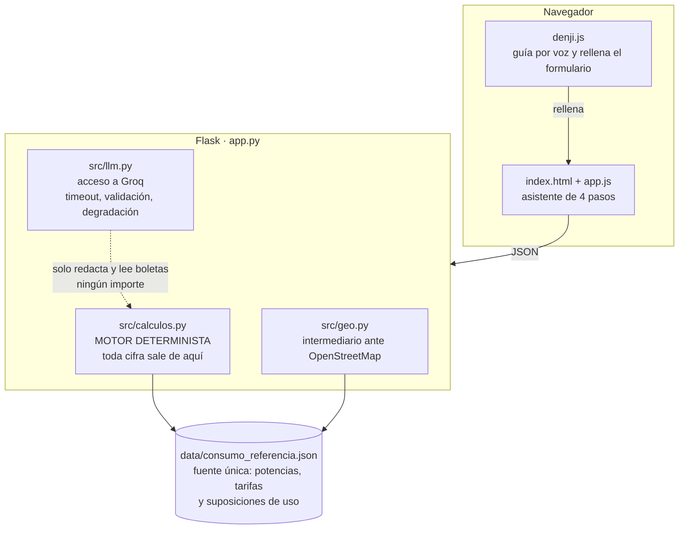
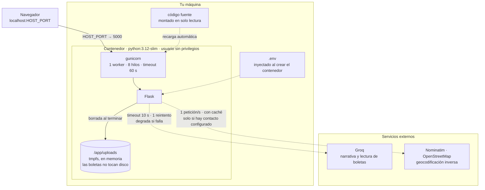
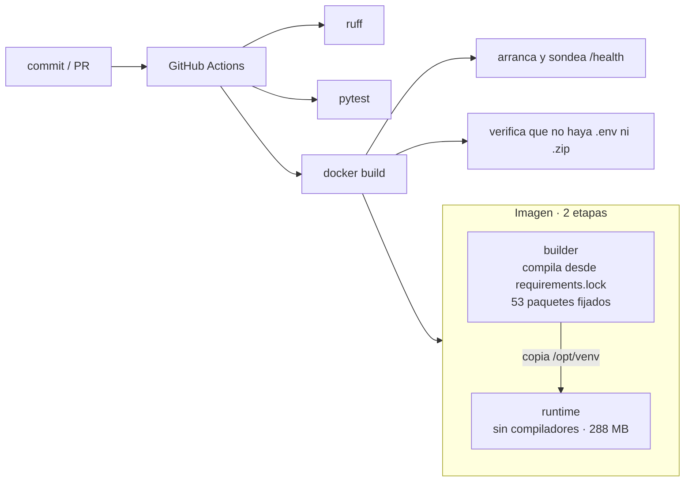

# ⚡ VólticvS — Asesor Energético Inteligente

Plataforma web para diagnosticar el consumo eléctrico de un hogar, estimar su ahorro potencial y dar
recomendaciones concretas. Soporta **24 países** de América y España, cada uno con su moneda y tarifa.

> **Los números son deterministas.** El cálculo lo hace [`src/calculos.py`](src/calculos.py) con
> física básica —potencia × tiempo, calor específico del agua— y el modelo de lenguaje **solo redacta
> la narrativa y lee las boletas**. Ningún importe sale de un LLM. Esta separación es deliberada:
> evita que el sistema alucine cifras de ahorro.

---

## Arranque rápido

### Con Docker (recomendado)

```bash
git clone https://github.com/alejolanda/desafioTeam49.git
cd desafioTeam49
cp .env.example .env      # y edita las claves, ver más abajo
docker compose up --build
```

La app queda en **http://localhost:5000**.

> **En macOS el puerto 5000 lo ocupa el receptor de AirPlay.** Usa otro puerto para el host sin tocar
> el interno: `HOST_PORT=5001 docker compose up`, o desactiva *Ajustes → General → AirDrop y Handoff →
> Receptor AirPlay*.

El código va montado en solo lectura con recarga automática: al editar `app.py` o `src/`, gunicorn se
reinicia solo. Para todo lo demás, ver [Comandos](#comandos) al final.

### Sin Docker

Requiere **Python 3.12+**.

```bash
python3 -m venv .venv && source .venv/bin/activate   # Windows: .venv\Scripts\activate
pip install -r requirements.txt
cp .env.example .env
python app.py
```

---

## Configuración

Todas las variables viven en `.env`, que **nunca** se versiona ni entra en la imagen de Docker.
[`.env.example`](.env.example) las documenta una a una; estas son las que importan:

| Variable | Qué hace | ¿Obligatoria? |
|---|---|---|
| `GROQ_API_KEY` | Narrativa y lectura de boletas | No, pero sin ella se degrada |
| `NOMINATIM_CONTACTO` | Correo de contacto del equipo | Para detectar la ubicación |
| `GROQ_TIMEOUT_S` | Segundos antes de abandonar una llamada al modelo | No (10) |
| `RATELIMIT_STORAGE_URI` | Redis, si se usa más de un worker | No (memoria) |
| `ENABLE_API_DOCS` | Sirve el contrato en `/openapi.yaml` | No (apagado) |
| `HOST_PORT` | Puerto del host, separado del interno | No (5000) |
| `INSTALAR_DOCS` | Mete Swagger UI en la imagen al construirla | No (0) |
| `FLASK_DEBUG` | **Dejar en 0.** El depurador de Werkzeug permite ejecución remota de código | No (0) |

**La aplicación funciona sin ninguna clave.** Sin `GROQ_API_KEY` el diagnóstico se calcula igual —es
determinista— y la narrativa cae a un texto de respaldo, marcado como tal en el campo
`narrativa_fuente`. Sin `NOMINATIM_CONTACTO` no se detecta la ubicación y se pide a mano; es
deliberado: su política de uso exige identificar la aplicación, y es preferible perder la función
antes que hacer peticiones sin identificar contra un servicio comunitario gratuito.

---

## Cómo funciona



El modelo de lenguaje **nunca calcula**: recibe cifras ya cerradas por `calculos.py` y solo las
redacta. La flecha punteada marca esa frontera, que es la decisión de diseño central del proyecto.

### Infraestructura



Las flechas punteadas son **opcionales**: si Groq o Nominatim no responden, o no están configurados,
la aplicación sigue funcionando con menos prestaciones. El diagnóstico nunca depende de ellos.

Un solo worker con hilos, y no varios procesos, porque el límite de tasa y la caché de
geocodificación viven en la memoria del proceso. Escalar exige antes apuntar `RATELIMIT_STORAGE_URI`
a Redis.

### Construcción y entrega



### Dos formas de estimar el consumo

1. **Declarado.** Escribes los kWh de tu boleta, o la subes y se extraen solos.
2. **Estimado.** Declaras tu equipamiento y se calcula artefacto por artefacto.

Si no das ninguno de los dos, el resultado es 0 con `fuente_consumo: "sin_datos"`. No se inventa una
cifra de relleno.

### De dónde sale el ahorro

De la suma real del consumo evitable de cada artefacto: lo que gasta un equipo en modo de espera
frente a lo que gastaría desconectado. Se calcula siempre, incluso cuando declaras el consumo de tu
boleta, porque sin desglose no hay forma de saber dónde está el ahorro.

> **Limitación conocida.** Hoy solo se monetiza el consumo fantasma. Las recomendaciones textuales
> sugieren ahorros mayores —bajar el aire acondicionado a 24 °C, lavar en frío, cambiar a LED— y
> ninguno de ellos entra todavía en la cifra. El `ahorro_estimado` es, por tanto, conservador.

---

## API

El contrato completo está en [`docs/openapi.yaml`](docs/openapi.yaml). Con `ENABLE_API_DOCS=1` se
sirve además en `/openapi.yaml`.

La interfaz visual de Swagger en `/apidocs` no viaja en la imagen por defecto —son ~9 MB de activos
que no pintan nada en producción, donde además la documentación va apagada. Para levantarla:

```bash
INSTALAR_DOCS=1 docker compose build && docker compose up -d   # con Docker
pip install -r requirements-dev.txt                            # sin Docker
```

y `ENABLE_API_DOCS=1` en el `.env`.

| Método | Ruta | Para qué |
|---|---|---|
| `GET` | `/health` | Sonda de vida. No llama a servicios externos |
| `GET` | `/api/paises` | Países soportados con su moneda y tarifa |
| `GET` | `/api/ubicacion` | Coordenadas → ciudad y código de país |
| `POST` | `/api/analisis-energetico` | Análisis del hogar. **El endpoint principal** |
| `POST` | `/api/calcular` | Cálculo por artefacto. Payload **distinto** al anterior |
| `POST` | `/api/subir-boleta` | Extrae consumo y tarifa de una boleta |
| `POST` | `/api/interpretar-campo` | Mapea texto libre a un tipo de vivienda |
| `POST` | `/api/comparar` | Compara artefactos. Catálogo de ejemplo |

Los endpoints que consumen servicios de pago tienen límite de tasa por IP y no piden credenciales;
sin tope, cualquiera podría agotar la cuota.

---

## Desarrollo

### Ejecutar la batería de pruebas

**Con un entorno local** (rápido, para iterar):

```bash
python3 -m venv .venv && source .venv/bin/activate   # Windows: .venv\Scripts\activate
pip install -r requirements-dev.txt
pytest
```

> El `venv/` que hay en el repositorio es de Windows y no sirve en macOS ni Linux. De ahí que el
> entorno nuevo se llame `.venv`, con punto: son directorios distintos y ambos están ignorados por git.

**Dentro de un contenedor** (misma versión de Python que la CI, sin instalar nada):

```bash
docker run --rm -v "$PWD:/app" -w /app python:3.12-slim \
  sh -c "pip install -q -r requirements-dev.txt && pytest"
```

Úsalo si tu Python local no es 3.12: la batería pasa igual en 3.9, pero solo esta vía reproduce
exactamente lo que corre en la CI.

Algunos tests solo corren con `ENABLE_API_DOCS=1` —los de la interfaz visual de la API— y se saltan
en caso contrario. Ninguno llama a Groq ni a OpenStreetMap: la batería funciona sin claves y sin red.

La CI ejecuta linter y tests en cada PR, construye la imagen de Docker, la arranca y sondea
`/health`, y falla si alguien versiona un `.env` o un `.zip`.

### Datos de referencia

[`data/consumo_referencia.json`](data/consumo_referencia.json) es la fuente única de potencias,
tarifas y suposiciones de uso. Cada valor lleva anotada su procedencia, y los que no están
verificados lo dicen explícitamente:

- **Tarifas por país:** referenciales, con el regulador de origen anotado. No están verificadas en
  tiempo real — envía `tarifa_kwh` con el valor de tu propia boleta para obtener importes exactos.
- **`perfil_hogar`:** las horas de uso al día y las veces por semana de cada equipo. Antes eran
  constantes escondidas en el código; ahora se pueden auditar y corregir aquí.
- **Marcados `SIN VERIFICAR`:** la potencia media de la lavadora y las tarifas de siete países.
  Sustituirlos por datos reales antes de presentar esto como asesoría.
- **`categorias_comparables`:** catálogo **de ejemplo**, con todos los precios en `null`.

---

## Estructura

```
desafioTeam49/
├── app.py                      Servidor Flask y endpoints
├── src/
│   ├── calculos.py             Motor determinista
│   ├── llm.py                  Acceso a Groq
│   └── geo.py                  Geocodificación inversa
├── data/consumo_referencia.json
├── templates/index.html
├── static/
│   ├── css/style.css
│   ├── js/app.js               Lógica del asistente
│   ├── js/denji.js             Asistente guiado
│   ├── img/
│   └── vendor/                 Lucide y la tipografía, servidos localmente
├── tests/                      Batería de pruebas
├── docs/
│   ├── openapi.yaml            Contrato de la API
│   ├── PLAN.md                 Plan de la auditoría de código
│   ├── PLAN-HACKATHON.md       Qué falta para cumplir las bases de EnergiAI
│   └── DECISIONES.md           Decisiones técnicas y su porqué
├── Dockerfile                  Multi-stage, sin privilegios
├── docker-compose.yml
├── requirements.txt            Dependencias directas
├── requirements.lock           Árbol completo fijado (build reproducible)
└── requirements-dev.txt
```

---

## Comandos

Referencia de lo que se usa a diario. Los de Docker asumen que estás en la raíz del proyecto.

### Levantar y parar

```bash
docker compose up -d                 # arrancar en segundo plano
docker compose up                    # arrancar viendo los logs
docker compose down                  # parar y eliminar el contenedor
docker compose restart               # reiniciar sin recrear
docker compose ps                    # ¿está viva? ¿en qué puerto?
docker compose logs -f               # seguir los logs en vivo
docker compose logs --tail 50 app    # las últimas 50 líneas
```

### Cuándo hace falta reconstruir

Editar `app.py`, `src/`, `static/` o `templates/` **no requiere nada**: el código va montado y
gunicorn recarga solo. El resto sí:

| Cambiaste… | Comando |
|---|---|
| El `.env` | `docker compose up -d --force-recreate` |
| `requirements.lock` o el `Dockerfile` | `docker compose up -d --build` |
| Quieres Swagger UI en la imagen | `INSTALAR_DOCS=1 docker compose build && docker compose up -d` |

El entorno se lee al **crear** el contenedor, no en cada petición: por eso un cambio en el `.env`
necesita `--force-recreate` y no basta con `restart`.

### Pruebas y linter

```bash
source .venv/bin/activate            # una vez por terminal

pytest                               # toda la batería
pytest tests/test_calculos.py        # un solo archivo
pytest tests/test_calculos.py::test_hervidor_coincide_con_la_termodinamica   # un solo test
pytest -k tarifa                     # los que coincidan con un nombre
pytest -x                            # parar en el primer fallo
pytest -q --cov=src --cov=app --cov-report=term          # con cobertura
pytest -q --cov=src --cov-report=html && open htmlcov/index.html   # cobertura navegable

ruff check .                         # linter
ruff check . --fix                   # y que corrija lo que pueda
```

### Comprobar que funciona

```bash
curl -s localhost:5001/health | python3 -m json.tool     # estado y qué hay configurado
curl -s localhost:5001/api/paises | python3 -m json.tool # catálogo de países

curl -s -X POST localhost:5001/api/analisis-energetico \
  -H 'Content-Type: application/json' \
  -d '{"pais":"CL","tv":2,"tv_frecuencia":21,"refrigerador":1}' | python3 -m json.tool
```

`/health` dice de un vistazo si las funciones opcionales están activas:

```json
{"estado":"ok","paises":24,"artefactos":31,
 "groq_configurado":true,"geocodificacion_configurada":true}
```

### Diagnosticar problemas

```bash
docker compose logs app | grep -i "GROQ_API_KEY rechazada"   # ¿la clave caducó?
docker compose logs app | grep -iE "error|warning"           # todo lo anómalo
docker compose exec app sh                                   # entrar al contenedor
docker compose exec app printenv | grep -c GROQ              # ¿llegaron las variables?
```

En el navegador, para el asistente de voz —consola con `Cmd+Option+J`—:

```js
denjiDiagnostico()            // navegador, permisos del micrófono, idioma
denjiUltimaTranscripcion      // lo último que se reconoció
```

Y filtra por `[denji:voz]` para seguir cada fase de la escucha.

### Git

```bash
git status --short
git log --oneline -10
git diff                             # cambios sin preparar
git diff --cached                    # los que ya están preparados
```

---

## Tecnologías

| Capa | Stack |
|---|---|
| **Backend** | Python 3.12, Flask 3, gunicorn, flask-limiter |
| **Modelo** | LangChain + Groq (Llama 3.3 70B; visión con Llama 4 Scout) |
| **Frontend** | HTML5, CSS3, JavaScript ES6+ — sin framework ni CDN |
| **Datos** | JSON de referencia, cálculo determinista |
| **Infra** | Docker multi-stage, GitHub Actions |

La interfaz **no hace ninguna petición a servidores externos**: los iconos y la tipografía se sirven
desde el propio proyecto. Funciona sin conexión a internet salvo por las funciones que requieren
modelo.

---

VólticvS © 2026 — Equipo Volti
